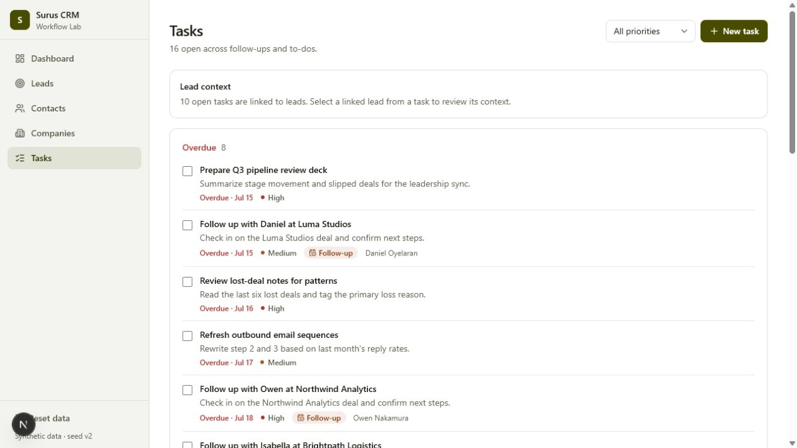
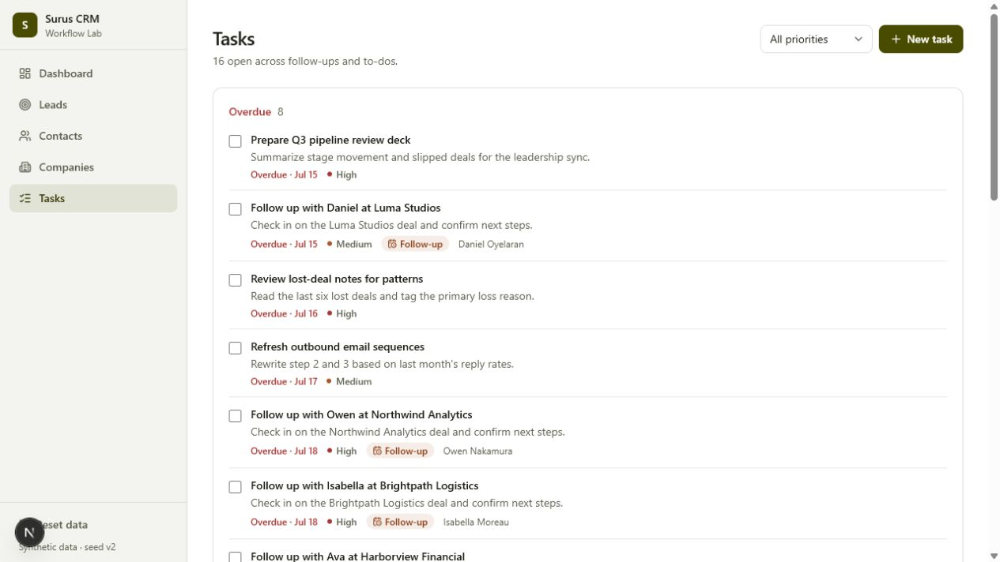

# Generic recurring-workflow discovery proof

**Date:** July 21, 2026
**Status:** Complete, applied, browser-checked, and exactly rolled back
**Data:** Explicitly synthetic CRM development telemetry

## What this proves

Living Software installed into a fresh, separately built CRM, mapped the host, captured ordinary browser activity, mined a recurring workflow without a CRM-specific detector or explicit friction signal, gave the exact minimized evidence to live Codex GPT-5.6, accepted one bounded patch proposal, proved and applied the exact artifact after human approval, rendered it in the browser, and restored the original source exactly.

This proves generic recurrence discovery and a governed evidence-to-source lifecycle. It does **not** prove that recurrence means friction, that the proposal caused an improvement, or that synthetic results generalize to production.

## Clean host and evidence boundary

| Fact | Verified value |
| --- | --- |
| Separate CRM starting commit | `545136b96cf0a6d3fdd9ddcae7733b3eeda8a6a8` |
| Product map | 144 nodes, 180 edges |
| Manifest hash | `sha256:61106691663c6fcbdc52de027250416b270284a2e0fef2f47492d8af7a5f234a` |
| Detector-bound evidence | first 22 hash-linked records; 79 events |
| Independent sessions/cases | 3 / 3 |
| Explicit signal events | 0 events with `metadata.signal` |
| Evidence origin | synthetic development telemetry |

The CRM simulator and its scenario labels were not detector or model inputs. Living used mapped event kind, manifest node identity, and event name.

## Workflow learned by the generic detector

`detector.workflow-pattern.repeated-sequence@1.0.0` learned this four-step sequence:

1. lead-link action;
2. lead-detail route completion;
3. back-link action;
4. leads-list route completion.

The exact event-name sequence was:

```text
observed.action.fee9beda42e919ef.click
-> observed.route.22f2a29660e5ba03.complete
-> observed.action.710cce993eb1361b.click
-> observed.route.eecb4484e890a43a.complete
```

It found six non-overlapping occurrences across three cases and three independent sessions. The opportunity `opportunity.repeated-sequence.18a79b944815` bound exactly 24 supporting events with event-set hash `sha256:2aeafcc3ecc809f793b6a73e5cc1f0c33c8951c5529b0b3c30b99baaeaebc1da`.

The threshold and candidate ranking are deterministic so identical evidence yields identical output. The workflow itself was mined from the host; it was not encoded as a CRM or lead-review rule.

## Live GPT-5.6 proposal and governed application

Two explicit Codex CLI GPT-5.6 Terra calls prepared `evolution.source.v2.bd05a314a3b6e29d4971bc8e`:

- brief thread `019f858a-a42c-7d83-a70b-54dd6241a29c` interpreted only the bounded evidence;
- patch thread `019f858a-ed88-7482-a455-c39a6325320e` saw the brief and three manifest-bound source candidates.

GPT selected `src/app/leads/[id]/page.tsx` and proposed one exact anchor replacement: `Leads` → `Back to leads`. Living treated it as untrusted and passed all 13 deterministic proof checks.

| Lifecycle fact | Verified value |
| --- | --- |
| Artifact hash | `sha256:3dd75414642f7002bcc08488730af38269704867e8c73e7ca3220717ca377e7c` |
| Proof hash | `sha256:dd05a4c236184f7f2e7cab3925cf00b4125d71dd0090aee7e1c28f16fad42074` |
| Preimage | `sha256:6f39fc74f30bc132cf3ba9b2975961a911be5e7197ba536ad4f7b69b907526e5` |
| Applied postimage | `sha256:89eb440c0888c05850fdd6dc4084ba7fcd4e85c29e7d22b50f2d58f030888bb1` |
| Human actor | `hackathon-demo` |
| Final status | `rolled-back` with 9 valid receipts |

After exact artifact/proof approval, Living applied the sealed postimage. The CRM passed 112/112 tests, and a real browser check showed `Back to leads` on the lead-detail UI. Explicit rollback then restored the byte-identical preimage above.

GPT had no terminal, browser, filesystem-write, approval, apply, test, or rollback authority.

## Independent second generic proof — Leads to Tasks

A second fresh host tested whether the same system could discover a different ordinary workflow and produce a materially different proposal. Its detector-bound evidence was the first 12 hash-linked records: 68 events across three cases and three independent sessions, with zero explicit signal events. Each session repeated `/leads` → `/tasks` twice. The generic detector found six non-overlapping occurrences and produced `opportunity.repeated-sequence.bc1fd36d9f4d` from the two-step route sequence.

Later apply/rollback browser verification added non-participating events and sessions to the same ledger. An analysis of the current full ledger therefore reports 89 events, six cases, six sessions, and 68% confidence, while the detector still binds the same exact 12 supporting route events. The original detector-bound snapshot remains 68 events, three cases, three sessions, and 85% confidence; the later denominator change does not rewrite that proof.

Two new live Codex GPT-5.6 calls then produced a different interpretation, target, and patch:

- brief thread `019f85a8-a92e-7123-87e0-f3c801ed4e0d` interpreted the recurrence as a possible need for shared context;
- patch thread `019f85a9-0327-7850-be99-33beef2457b6` selected `src/app/tasks/page.tsx`;
- evolution `evolution.source.v2.672622f9c94f7121dcc8217c` added a `Lead context` card with the count of open tasks linked to leads and guidance to open a linked lead from a task.

| Lifecycle fact | Verified value |
| --- | --- |
| Artifact hash | `sha256:6a6e2d1adb53b8cb6e3651953ddb63fc9bec53139e4a009d550e8053926e84d9` |
| Proof hash | `sha256:bbd3a118e542f0d4c0e0b97c92894f35f75b6990018137bb78220617112d435c` |
| Preimage | `sha256:40e4afc91d422a2d06ff1f13186417cb5d4f822c1e0ef4a852f32a4dc85e6a54` |
| Applied postimage | `sha256:ddd139ea8051ac884219e332aaf9fa3393f858b893c1d955836bb08ed6f96c5c` |
| Deterministic proof | 13/13 checks passed |
| Host verification | 112/112 CRM tests passed; card inspected in the browser |
| Final status | `rolled-back`; 9 valid receipts |
| Final chain head | `sha256:0e41482bbdc957afa00304bc0db999e1dfe64d54e77fec68d7e353c02d62401c` |

The applied browser state visibly contained the GPT-authored card:



After explicit rollback, the browser showed the original Tasks page without that card:



This independent run demonstrates that neither the original lead-detail label nor its source target was embedded in the detector. It still proves only generic recurrence discovery, bounded GPT authorship, governed application, runtime rendering, and exact restoration—not that the added card improved user outcomes.

## Secondary failed sort stress test — not generic proof

After the clean proof was completed, applied, checked, and rolled back, rapid sort toggles added later evidence. That activity emitted three explicit `rage-click` signals. Under deterministic multi-detector arbitration, `failure-cluster` therefore won instead of `repeated-sequence`.

This is an honest secondary technical diagnostic of signal capture and arbitration. It must not be presented as proof that generic sequence mining discovered the sort behavior, as causal evidence of user frustration, or as measured workflow improvement.

## Remaining limits

- All evidence is synthetic and development-only.
- Recurrence can be intentional; only a reviewer and future measurement can assess value.
- Source application and browser rendering do not establish post-change improvement.
- Automatic capture and comparison of a post-change cohort remains future work.
